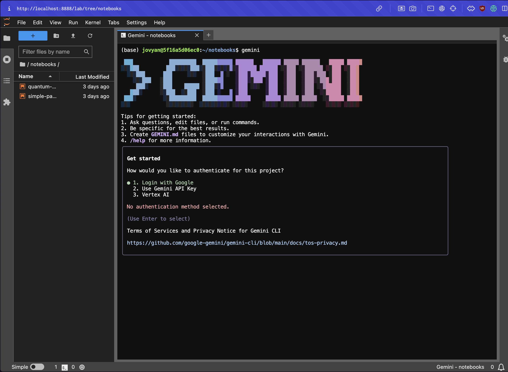

# Quantum Computing Jupyter Lab

A Docker-based JupyterLab environment for quantum computing experiments using Qiskit and Google's Gemini AI CLI.

## Prerequisites

### Install Docker

#### **macOS**
Install **OrbStack** (recommended for Mac):
1. Visit [https://orbstack.dev/](https://orbstack.dev/)
2. Download and install OrbStack
3. Launch OrbStack from Applications
4. OrbStack is lighter and faster than Docker Desktop on Mac

Alternatively, you can use **Docker Desktop**:
1. Visit [https://www.docker.com/products/docker-desktop/](https://www.docker.com/products/docker-desktop/)
2. Download Docker Desktop for Mac
3. Install and launch Docker Desktop

#### **Windows**
Install **Docker Desktop**:
1. Visit [https://www.docker.com/products/docker-desktop/](https://www.docker.com/products/docker-desktop/)
2. Download Docker Desktop for Windows
3. Install Docker Desktop
4. Ensure WSL 2 backend is enabled during installation
5. Launch Docker Desktop

## Setup Instructions

### 1. Clone or Navigate to This Repository

```bash
cd /path/to/quantum-computing-jupyter-lab
```

### 2. Start the Docker Compose Stack

Run the following command to start JupyterLab in detached mode:

```bash
docker compose up -d
```

This will:
- Pull the Jupyter base notebook image
- Install vim, curl, Node.js, and Gemini CLI
- Start JupyterLab on port 8888

### 3. Configure Gemini CLI with OAuth Credentials

Run the following command in a terminal inside jupyter lab to configure the Gemini CLI:

```bash
gemini
```

3. Follow the authentication flow (review provided image):
   - The CLI will provide a URL
   - Open the URL in your browser
   - Authorize the application
   - Copy the authorization code back to the terminal



Alternatively, if you have the OAuth credentials file:

```bash
gemini auth login --credentials /path/to/credentials.json
```

### 4. Access JupyterLab

Open your browser and navigate to:

```
http://localhost:8888
```

**Login credentials:**
- Token: `token` (as configured in docker-compose.yaml)

You can access JupyterLab directly with the token in the URL:
```
http://localhost:8888/?token=token
```

## Managing the Environment

**Stop the container:**
```bash
docker compose down
```

**View logs:**
```bash
docker compose logs -f
```

**Restart the container:**
```bash
docker compose restart
```

**Rebuild after changes:**
```bash
docker compose up -d --build
```

## Troubleshooting

**Port 8888 already in use:**
```bash
# Change the port in docker-compose.yaml from "8888:8888" to "8889:8888"
# Then access via http://localhost:8889
```

**Container won't start:**
```bash
docker compose logs jupyterlab
```

**Reset everything:**
```bash
docker compose down -v
docker compose up -d
```

## Useful Documentation

- **Gemini CLI Documentation**: [https://ai.google.dev/gemini-api/docs/cli](https://ai.google.dev/gemini-api/docs/cli)
- **Qiskit Documentation**: [https://qiskit.org/documentation/](https://qiskit.org/documentation/)
- **Docker Documentation**: [https://docs.docker.com/](https://docs.docker.com/)
- **Docker Compose Documentation**: [https://docs.docker.com/compose/](https://docs.docker.com/compose/)
- **JupyterLab Documentation**: [https://jupyterlab.readthedocs.io/](https://jupyterlab.readthedocs.io/)
